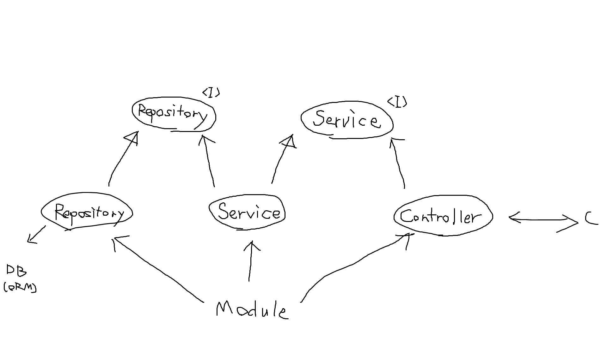

# NestJS を始めよう

## [NestJS](https://nestjs.com/) ってなに？

[TypeScript](https://www.typescriptlang.org/) で書かれた [Node.js](https://nodejs.org/ja/) 向けのバックエンド フレームワーク。

## そもそも TypeScript とは？

JavaScript のスーパーセット (上位互換)。Microsoft 製。最終的に JavaScript へ変換される。

JavaScript は構文が単純なうえ、ブラウザーさえあればどんな環境でも動作するため、Web 2.0 の登場とともに広く使われた。しかし、動的型付けであることなどを筆頭に、バグを生む温床となりやすい仕様が数多く存在している。  
そうした仕様を改善し、より堅牢でメンテナンス性の高い言語を求めて作られたのが TypeScript である。

## Node.js とは？

JavaScript はもともとブラウザー上で動作するクライアントサイドの言語である。  
したがって、非常に単純な処理を行わせるためのスクリプト言語として使われることが多かったが、次第に普通の言語と同じように使用できるようにしたいという考え方が出てきた。

そこで、Chromium (Google Chrome の派生元) に搭載されていた超高速な JavaScript エンジンである V8 Engine をベースに、コンピューター上で動作させられるよう拡張したものが Node.js である。  
軽量なスクリプトとしても使われるほか、サーバーサイドの環境としても利用される。

ごく最近になって Node.js の後継として開発された [Deno](https://deno.land/) がリリースされたが、完全な移行にはまだしばらく時間がかかると思われる。

## NestJS があるとなにが嬉しいのか？

NestJS は、バックエンド、すなわちサーバー側の処理を行うのに適している。  
主に以下のような特徴を持っている。

### TypeScript-friendly

NestJS そのものが TypeScript で書かれており、TypeScript の機能を活かしたスマートなコーディング体験を可能にしている。  
Express.js などの従来のフレームワークでも TypeScript をサポートしていることは多いが、その多くは JavaScript を前提に設計されており、最新の機能を活かしきれていない。

### 明確で堅牢なアーキテクチャー

NestJS は、Repository (無理に導入する必要はないが推奨)、Service、Controller と、これらを管理する Module によって構成される。

軽く各モジュールの説明をしておく。

<br>

#### Repository

データベースの操作を提供するモジュールである。  
Repository は、ビジネス ロジック (要件を実現させるための本質的なロジック) とデータベース アクセスを分離するためによく採られる手法であるリポジトリ パターンにおける概念のひとつ。

ビジネス ロジックが直接データベースで依存してしまうと、本来の関心事ではないロジックが混ざってしまううえ、別のデータベースへ移行する際に問題が生じやすい。  
そこで、中間層として Repository を実装し、ビジネス ロジックとデータベースを分離させる。

#### Service

いわゆるビジネス ロジックに相当するモジュールである。Repository とやりとりし、Controller へ対して機能 (usecase) を提供する。

#### Controller

クライアントとやりとりをするモジュールである。Service が提供する機能を外部へ公開する。

#### Module

上記 3 つのモジュール間の依存関係を解決するモジュールである。  
一種の DI (dependency injection, 依存性の注入) コンテナーとして動作する。

<br>

ここで、依存関係は以下のようになる。

```txt
DB <-依存-- Repository --実装-> RepositoryInterface <-依存-- Service --実装-> ServiceInterface <-依存-- Controller

(Module はすべての実装へ依存する)
```

Repository、Service、Controller 間は Interface を使用して契約に依存するように設計する。

  
(これは MS ペイントで書いた概念図)
